## Zgodba o škofjeloškem grbu

V škofjeloškem grbu je slika črnca; zgodba pravi, naj bi rešil življenje škofu, ko je ustrelil nesrečnega medveda, ki jima je nekega (zanj prav nič lepega) dne prekrižal pot. Sestavimo preprosto igro, v kateri bo moral igralec opraviti podobno nalogo.

### Scenarij in zemljevid

Če hočeš sestaviti pustolovščino, si moraš najprej izmisliti scenarij. Vsaj približno; če se boš kasneje domislil še česa, ga boš pač dopolnil.

Igralec bo moral torej na škofjeloškem gradu bo moral ustreliti medveda. Če hočeš streljati, potrebuješ puško. Kako jo dobiti? Morda v zamenjavo za vino. Tega pa bo zaslužil z obiranjem grozdja.

Povedano v pravo smer:
- v Čatežu (tistem ob Litiji, kjer imajo vino in ne tistem, kjer imajo le toplo vodo) bo obiral grozdje in dobil vino;
- v Kočevju bo dal nekemu lovcu vino in v zamenjavo dobil njegovo puško;
- na škofjeloškem gradu bo ustrelil medveda.

Poleg Čateža, Kočevja in gradu bodo v igri še Škofja Loka, Kranj, Ljubljana (kjer se bo igra začela) in Ribnica.

Da igralcu povzročimo nekaj dodatnih sitnosti, se bo moral, ko dobi puško, izogibati Ribnice, saj bo tam prežal policist, ki mu bo zaplenil puško in mu dal namesto nje kuhalnico. Ker Ribnica.

Nato si je potrebno zamisliti zemljevid. Ta bo na koncu takšen

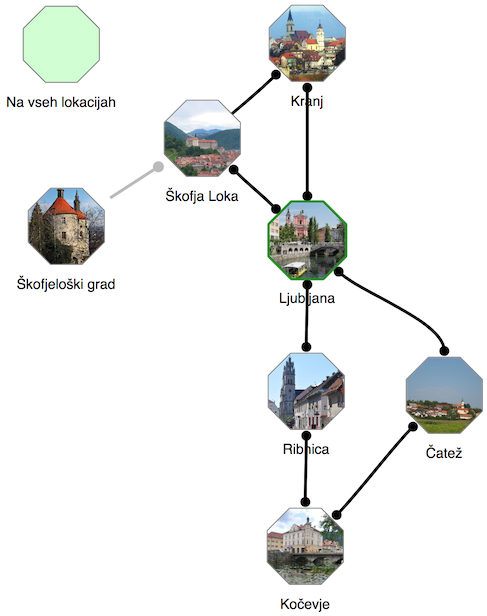

Vsak kraj je predstavljen z osemkotnikom, ker so kraji običajno povezani z eno od osmih smeri (S, SV, V, JV, J, JZ, Z, SZ). Kakšne so povezave med kraji na sliki, je očitno: iz Ribnice, na primer, lahko gremo na sever v Ljubljano ali na jug v Kočevje. Iz Kočevja gremo na sever v Ribnico in severozahod v Čatež.

Če iz nekega kraja vodi pot vzhodno v nek drug kraj, ni nujno, da se iz drugega kraja na zahod pride nazaj v prvi kraj. Na zemljevidu vidimo dva primera, ko to ne drži.
- Če gremo iz Ljubljane na JV, pridemo v Čatež. Če želimo iz Čateža nazaj v Ljubljano, moramo na S, na SZ. Da je tako, vidimo po tem, kje vodijo povezave iz Ljubljane in iz Čateža. (Pot na SZ bi lahko peljala celo v kak drug kraj.)
- Če gremo iz Kranja na JZ, pridemo v Škofjo Loko. Poti iz Škofje Loke v Kranj pa ni - razen prek Ljubljane. To vidimo po tem, da v Škofji Loki na koncu povezave ni krožca. (Čemu? Zato da nagajamo. Če mu damo v Škofji Loki le izbiro med potjo v Ljubljano in na grad, ne pa tudi v Kranj, je verjetneje, da bo šel na grad, kjer pa ga, vemo, čaka medved.)

Ko sestaviš scenarij za igro, si lahko na papir skiciraš tudi zemljevid, saj bo hitreje. Detajle pa lahko urejaš kar na računalniku.

### Risanje zemljevida

Celoten postopek sestavljanja lahko vidiš v videu. Vseeno preberi tudi spodnji opis, da boš boljše razumel, kaj je kaj in zakaj.

<iframe width="858" height="501" src="https://www.youtube.com/embed/TGbbZNEDWK8?rel=0" frameborder="0" allow="autoplay; encrypted-media" allowfullscreen></iframe>

Ko odpremo Odiseja, dobimo zemljevid z dvema krajema. Eden ima posebno vlogo in čudno ime, *Na vseh lokacijah*. Za zdaj ga pustimo.

Drugi je *Začetna lokacija*. To je kraj, kjer se igra začne. Dvoklikni ga. Odprlo se bo okno za urejanje lokacije. V njem bomo preživeli še veliko časa (pravzaprav kar večino), a zdaj le spremeni ime kraja iz *Začetna lokacija* v Ljubljana. Zapri okno za urejanje lokacije, tako da klikneš izven njega.

Povleci Ljubljano nekam bolj na sredo. Zdaj premakni miško nad Ljubljano, tako da se puščica spremeni v puščico navzgor, proti severu. Povleci črto navzgor, tja, kamor želiš postaviti Kranj.

Ko izpustiš tipko na miški, se pojavi nova lokacija in odpre okno, v katerem spremenimo ime v Kranj. Zapri okno za urejanje.

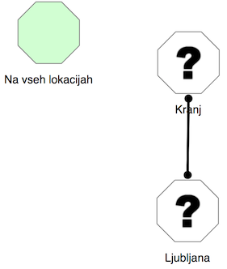

Kraja sta povezana: ker smo povezavo iz Ljubljane v Kranj pripeljali tako, da smo šli na sever, je računalnik sam dodal še povezavo iz Kranja na jug v Ljubljano.

Zdaj dodajmo še Škofjo Loko. Vse je podobno kot pri Kranju, le da zdaj vlečemo iz Ljubljane proti severozahodu.

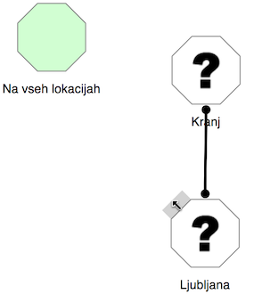

Preimenujemo v Škofjo Loko.

Zdaj pa naredimo še povezavo iz Kranja v Škofjo Loko. Povezavo začnemo vleči iz jugozahodne strani Kranja in jo potegnemo v Škofjo Loko.

Je tako, kot smo hoteli? Skoraj. Rekli smo, da nočemo povezave iz Škofje Loke v Kranj. Znebimo se je tako, da kliknemo krogec, ki je na škofjeloškem koncu te povezave. Če kliknemo na črto, pa pobrišemo obe smeri povezave.

Zdaj na podoben način dodaj še ostale povezave, le škofjeloški grad za zdaj izpustimo.

Še en trik: recimo, da si prišel do sem.

Kako povezati Ljubljano in Čatež tako, da bo povezava iz Ljubljane v Čatež vodila na JV, v obratno smer pa na S? Črto vleci od JV strani Ljubljane do S strani Čateža, namesto, da bi jo potegnil v Čatež.

Če pa si kako povezavo že potegnil in ni tam in takšna, kot bi morala biti, jo preprosto klikni, da jo pobrišeš, in potem povleci novo.

Če med dvema lokacijamo povlečemo več povezav (da, tudi to je možno - zakaj ne bi iz Ljubljane prišli v Kranj, tudi če gremo proti severovzhodu?), bo na sliki malo zmede. Še pogosteje to naredimo ponesreči. Kar poklikaj odvečne povezave, pa bodo izginile.

Zdaj pa še škofjeloški grad. Do njega bomo prišli tako, da bomo šli v Škofji loki **gor**. Na zemljevid ga dodaj tako, da dvoklikneš na mestu, kjer bi ga rad postavil. Pojavila se bo nova lokacija. Preimenuj jo v Škofjeloški grad.

Ko je zemljevid narisan, ga malo uredi, tako da premakneš lokacije. Naj bo videti lepo in urejeno.

Če želiš premakniti več lokacij hkrati, jih označi in premakni. Več lokacij označiš tako, da potegneš z miško prek njih. Posamične lokacije lahko dodajaš med izbrane tako, da jih klikaš z miško in zraven držiš tipko za velike črke.

Z zemljevidom naše igre smo tako končali. Če bi sestavljali kaj bolj zapletenega, pa bi ga lahko sestavljali tudi postopno in vmes morda že kaj programirali in preskušali.

### Opisi lokacij in slike

Naslednji korak pri sestavljanju igre so opisi lokacij. Na začetni lokaciji je dobro povedati, kaj je pravzaprav cilj igre. V Ljubljani smo zato napisali

> Tvoja naloga v igri je poiskati slavo. V Ljubljani nimaš česa iskati. Pojdi raje ven, v širni svet.

V Škofji Loki bomo igralca posebej povabili, naj si ogleda grad (in zamolčali medveda).

> Okrog lepega mesteca se dvigujejo hribi. Na najbližjem je simpatičen grad. Si ga boš ogledal?

V Čatežu povejmo za vinograde, da bo imelo obiranje grozdja smisel.

> Od Čateža pa skoraj do Litije, vsepovsod naokrog se širijo bregovi polni vinogradov.

Opisi so lahko tudi zabavni. Tale je sestavljen po zgledu prve slovenske računalniške igre, Kontrabant, iz leta 1984.

> V smrtnem kranju našega prešernega pesnika. Na jugozahodu vidim nekaj zanimivega.

Tudi kočevski je podoben.

> Gottscher je znan po lovcih, ki vsak večer odhajajo na fronto. Radi pa tudi kaj popijejo, če je že treba.

V Ribnici malo posvarimo pred policisti. Le tega, s čim bodo delali preglavice, še ne izdajmo.

> Mesto, znano po suhi robi, je danes znano po policistih, ki merijo hitrost mimoidočim vozilom. Le počasi naprej.

Še škofjeloški grad je ostal. Tu nastopi medved.

> Grad je že lep, medved, ki se sprehaja okrog njega, pa ni videti prijazno.

Seveda lahko namesto teh opisov sestaviš svoje. Pravzprav jim moraš. Bognedaj prepisovati tale besedila!

Nato dodaj še slike. Lahko jih poiščeš na internetu, za svoje igre pa jih lahko rišeš tudi sam. Dodaš jih v oknu za urejanje lokacije, levo zgoraj.

Pa smo: zemljevid bi moral zdaj izgledati tak kot na sliki na začetku, razen sive povezave med Škofjo Loko in gradom. Ta se bo pojavila kasneje.

Zdaj pa se začne zabavni del: programiranje!

### Ukazi

Na vsaki lokaciji lahko določimo ukaze, ki jih bo igralec lahko (ali pa tudi ne) izvršil. Začnimo z najpreprostejšim v naši igri: če igralec v Čatežu izbere "Obiraj grozdje", bo v zahvalo dobil steklenico vina.

Odpri urejanje lokacije Čatež in v delu pod opisom sestavi takšno zaporedje blokov:

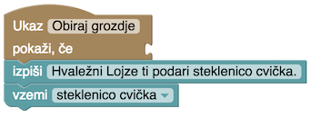

Če poznaš Scratch, veš, kako gre; tole ni veliko drugače. Če ga ne, se boš pa hitro naučil, saj je preprosto.

Bloke boš našel na desni strani: klikni *Ukazi* in izvleci blok *Ukaz*. Daj mu ime, Obiraj grozdje. Kar vpišeš tu, bo igralec videl na tipki, ki jo bo lahko izbral v igri.

Pod blokom Ukazi sestavimo program, ki izvede ta ukaz. Izpisali bomo, da je igralec dobil steklenico cvička (za nedolžne mlade igralce: dolenjsko vino nekoliko kislejšega okusa). Tudi blok *Izpiši* najdemo med ukazi.

Drugi blok poskrbi, da bo igralec tudi v resnici (no, ne čisto v resnici, le v igri) dobil to steklenico.

Večina iger tega tipa se vrti okrog "stvari". Včasih jih dobimo zastonj, včasih jih s čim zaslužimo, z njimi trgujemo --- včasih pa jih tudi porabimo, izgubimo ali pa nam jih vzamejo. Kako reč lahko naredimo le, če imamo ustrezno stvar (kam boš veslal brez čolna?). Stvari, ki jih imamo, nas lahko pred čim obvarujejo (če začne v igri deževati, bo igralec moker, če nima dežnika). Stvari, ki jih imamo, nam lahko celo kaj preprečijo (z blatnimi škornji nas ne spustijo v gostilno). Ker so za igro tako pomembne, jim je namenjenih veliko blokov, zbranih v zavihku *Stvari*.

Iz zavihka Stvari torej izvleci blok *Vzemi* in ga dodaj k programu. V spustnem menuju v bloku izberi *Nova stvar* in vtipkaj njeno ime. V slovenščini bo najboljše, če vneseš ime z malo začetnico in v četrtem sklonu, torej "*steklenico*" in ne "*steklenica*". V igri se bodo namreč izpisovali stavki kot "*imaš steklenico*" in "*vzemi steklenico*"; če kot ime stvari vnesemo "*steklenica*", se bo izpisalo "*imaš steklenica*" in tako sklanjanje bodo zares cenili le Ižanci.

Smo? So bloki pripravljeni?

Tedaj pa le poskusimo. Preskusi igro (klikni gumb *Preskusi*), v Ljubljani izberi JV in nato Obiraj grozdje. Če je vse, kot mora biti, si dobil tole.

Klikni Ustvari, da se vrneš v urejanje igre.

### Skrivanje ukazov

Zdaj je na vrsti Kočevje. Tu nekomu damo steklenico cvička in dobimo puško.

Kaj počne blok *Uniči*, je očitno: igralcu vzame cviček. Obstaja podoben blok *Spusti*, ki pa tule ne bi bil pravi: blok *Spusti* postavi stvar na trenutno lokacijo in ker stvar leži tam, jo lahko igralec meni nič tebi nič ponovno vzame. Tega pa tule nočemo.

V bloku *Vzemi* sestavimo novo stvar, puško. To že znamo.

Zanimiv pa je pogoj, *ima igralec steklenico cvička*. Izvlečemo ga iz zavihka Stvari in vstavimo v blok ukazi. Tako dosežemo, da se bo ukaz *Ponudi cviček* res pokazal le, kadar igralec to lahko stori.

Če si radoveden, lahko igro do sem takoj preskusiš. Sicer pa nadaljujemo z Ribnico.

### Avtomatski ukazi in pogoji

V Ribnici imamo policista, ki igralcu vzame puško in da kuhalnico. To se zgodi samo od sebe, ne da bi igralec "ukazal" policistu, naj ga oropa. Zgodi pa se le, če ima igralec puško. Sestaviti moramo tole.

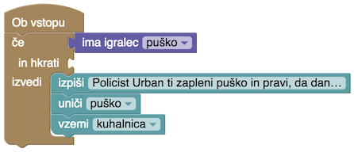

V zavihku *Ukazi* imamo poleg bloka *Ukaz* še nekaj drugih načinov proženja ukazov: Ob vstopu, Ob izstopu, Po vsakem ukazu in, čistu na dnu, Ob začetku igre. Kdaj se izvrši kateri, je najbrž očitno. Tule potrebujemo Ob vstopu, da bo policist igralca pograbil takoj, ko ga vidi.

Ker mu puško vzame le, če jo ima, uporabimo blok *Če*. Najdemo ga v zavihku *Pogoji*. Zgoraj mu prinemo pogoj *ima igralec puško*. Kot vse, kar je povezano s stvarmi, ga bomo našli v zavihku *Stvari*. Ukaze, ki se izvedejo, če je pogoj izpolnjen, nanizamo v blok *Če*, znotraj vdolbine *izvedi*. Vse, kar potrebujemo tam, že poznamo: izpišemo "Policist Urban ti zapleni puško in pravi, da dandanes zadošča kuhalnica." (na sliki se vidi le začetek besedila), uničimo puško in igralcu damo kuhalnico.

### Premikanje med lokacijami

Kako bo prišel igralec iz Škofje Loke na grad? Z ukazom *Gor*. Ker ga ni med običajnimi smermi, ga dodamo sami. V Škofji Loki torej ustvarimo blok

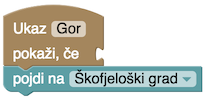

Blok *Pojdi* najdeš med *Ukazi*.

### (Prezgodnji) konec igre

Če se igralec prikaže na škofjeloškem gradu brez puške, naj ga čaka tole.

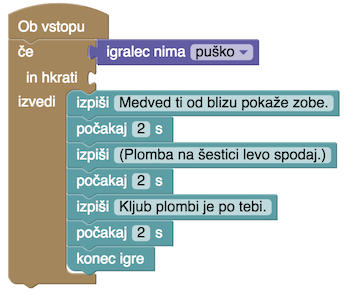

"Igralec nima puško" ni ravno zgledna slovenščina ... a igralec tega na srečo ne bo videl. Mi bomo pa bomo že potrpeli; računalnik se pač težje nauči sklanjanja.

Novost sta bloka *Počakaj* in *Konec igre*. Prvega navadno vtaknemo med kake izpise, če jih hočemo narediti bolj dramatične. Kam damo drugega, je očitno.

Medved bi se lahko še malo ponorčeval iz kuhalnice: "*Kuhalnica? Si prišel kuhat divjačinski golaž ali kaj?*"

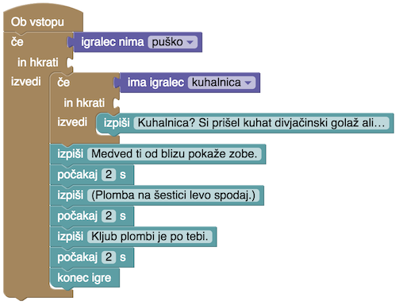

### (Zmagoslavnejši) konec igre

Če se igralec prikaže s puško, mu ponudimo, naj ustreli. Ker so časi drugačni kot nekoč in so medvedi dandanes zaščiteni bolj kot medvedi, bomo kosmatinca pustili pri življenju.

In streljanje bo videti tako.

### Preskušanje

Ko igro končaš, boš v njej gotovo opazil še kaj napak. Še verjetneje jih bodo odkrili igralci. Pri programiranju je pač vedno tako: tudi najprevidnejši programer ne more napisati programa brez napak.

Naša igra ima vsaj eno: če policist zapleni puško, lahko gre igralec ponovno obirat grozdje. Morda to hočemo, morda pa bi radi to preprečili, tako da igralec, ki zamoči na ta način, napake ne more več popraviti.

Tega ni težko popraviti. Dodamo blok *Če* in prestavimo pogoj *se ta ukaz še ni izvedel* vanj. Lojze naj bo hvaležen in igralec naj dobi cviček le, če se ukaz še ni izvajal, sicer pa naj bo igralec toplo povabljen, naj se spet oglasi prihodnjo jesen.

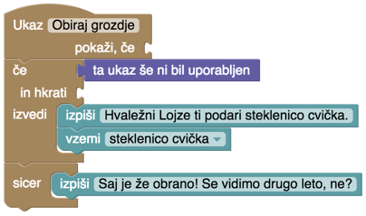

Lahko pa ne zafrkavamo igralca, temveč ukaz kar skrijemo.

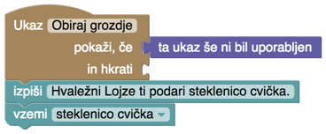

Še boljše je, če ga skrijemo tako:

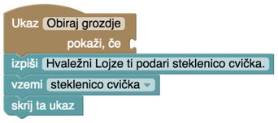

Blok "Skrij ta ukaz" omogoča, da ukaz skrijemo le, kadar je bil uspešno izveden. Če bi obiranje grozdja zahtevalo, hm, rokavice, bi lahko naredil tako:

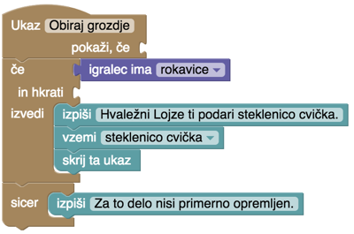

Če igralec nima rokavic, bo ukaz ostal viden. Če jih ima, dobi cviček, ukaz pa za vedno izgine. No, ne za vedno, temveč le do konca te igre.

Ne spreglej scenarističnega trika: igralcu smo povedali le, da potrebuje še nekaj. Kaj, pa naj ugane sam. :)
