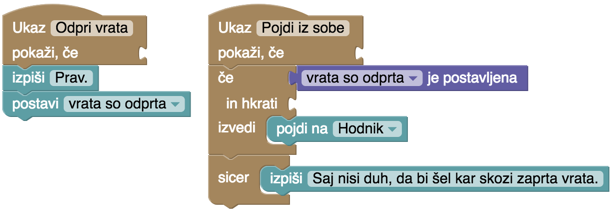

## Pobeg iz stanovanja

Zdaj znamo sestaviti zemljevid in dodajati ukaze lokacijam, srečali pa smo tudi reči, ki se zgodijo same od sebe - v glavnem nič dobrega, le policiste, ki delijo kuhalnice in medvede, ki kažejo zobe. Predvsem pa smo delali s stvarmi: vse, kar se je v igri spreminjalo, je bila pozicija igralca in seznam stvari, ki jih prenaša.

Razmislimo o tem scenariju: igralec je v sobi in hoče ven. Za to mora najprej odpreti vrata in nato izstopiti. Če ne odpre vrat, ne more ven.

Znamo sprogramirati takšen scenarij? Za silo.

Igralcu ostane ob odpiranju vrat v roki kljuka in če jo ima, lahko izstopi.

Deluje že, ni pa najbolj elegantno. Najbrž mora obstajati kak drug način, da si zapomnimo, da so vrata odprta? Obstaja: takole.

Preprosto: zapomnimo si *vrata so odprta*. Takemu "zapomku" rečemo *zastavica*. Zastavico *postavimo* in potem preverjamo, ali je *postavljena*. Oba bloka -- *postavi* in *je postavljena* -- najdeš v zavihku *Zastavice*.

Zapletajmo naprej. Odprtih vrat se ne da odpreti še bolj. Pač pa jih lahko zapremo. Ukaz za odpiranje vrat naj se torej pokaže le, če niso odprta (če zastavica *vrata so odprta* ni postavljena). Ukaz za zapiranje pa, seveda, če je postavljena.

Spoznali smo še dva nova bloka za zastavice: *ni postavljena* in *pobriši*. To je vse, le štirje so. A s temi štirimi bloki lahko sprogramiramo prav imenitno zapletene scenarije.

S hodnika se pride na dvorišče, kje je pes, ki nas ne spusti na cesto. (Vem, vem, psi navadno čuvajo hiše. Tale pač čuva cesto. Čuden pes.) Pa dodajmo v hišo še kuhinjo, v njej hladilnik, v hladilniku klobasa. Igralec mora priti v kuhinjo in odpreti hladilnik. Če je hladilnik odprt, lahko vzame klobaso.

Tole poskusi sprogramirati sam, preden škiliš na spodnjo sliko, prav?

Zemljevid bi lahko bil takšen (če so tvoje smeri drugačne, je to seveda tudi prav).

Tule pa so ukazi za hladilnik.

Ukaza za odpiranje in zapiranje sta enaka kot pri vratih. Le izpis smo preskočili, saj niti ni potreben.

Ukaz Vzemi klobaso se bo pokazal, če velja dvoje: hladilnik mora biti odprt in igralec še ni vzel klobase. Za drugo je najbolj prikladen pogoj *se ta ukaz še ni izvajal*, ki smo ga že spoznali v (se spomniš?) Čatežu, da smo poskrbeli, da igralec ne bi dvakrat obiral istega grozdja in prišel do preveč cvička.

Zdaj pa Dvorišče in pes. Sprogramiraj ukaz, Daj psu klobaso, s katerim damo psu klobaso. Ta si to zapomni. Drugi ukaz naj bo V (ali tista smer, ki si si jo izbral na svojem zemljevidu); če pes nima klobase, naj zarenči, če jo ima, pa pomiga z repom in igralec se znajde na cesti.

Ukaz, s katerim damo psu klobaso, se pokaže le, če jo imamo. Lahko bi ga pokazali tudi vedno (tako kot smo odpiranje vrat), in potem znotraj ukaza preverili, ali igralec v resnici ima klobaso in ga zafrkavali, če je nima.

Razlika med tema možnostima je velika. Če se ukaz pokaže v vsakem primeru, smo igralcu "izdali", kako bo ukrotil psa. Ko vidi ta ukaz, ve, da se mora vrniti v hišo in poiskati klobaso. Če se ukaz pokaže le v primeru, da igralec ima klobaso, pa je igra težja, saj ne ve vnaprej, s čim bo ukrotil mrcino.

Če mu torej damo klobaso, se mora pes ustrezno zahvaliti za klobaso, jo uničiti in postati srečen. Predvsem na uničevanje klobase ne smemo pozabiti, sicer jo bo igralec dal in obdržal hkrati.

Drugi ukaz, V, naj se pokaže v vsakem primeru. Tudi tega bi lahko skrivali, vendar ... naj igralec ve, da obstaja neka pot na vzhod, vendar bo moral, če hoče tja, nekaj ukreniti glede psa. Znotraj ukaza pa preverimo, ali ga pes spusti ali ne.

Če damo ukazu ime S, SV, V, JV, J, JZ, Z ali SZ, se ne pokaže med ostalimi ukazi, ki jih naredimo sami, temveč med smernimi ukazi na desni. To je praktično, saj na ta način igralec ne more vedeti, ali gre za običajen, vedno dovoljen premik, ali pa so z njim povezani kakšni dodatni triki.

Sem napisal dodatni triki? Tule je eden. Kaj, če bi se tale pes vedel malo drugače? Če ne bi bil čuvaj ceste temveč čuvaj klobas? Če nimaš klobase, te spusti mimo, če jo imaš, pa te požre (skupaj s klobaso)?

Če narediš takole, bo igralec vedno mislil, da je to čisto navadna pot na vzhod ... ko se bo pred psom slučajno pokazal s klobaso, pa bo na svojo smolo odkril, da ne.

A pustimo to stranpot. Igro raje zapletimo drugače. Recimo, da je tale pes ena nehvaležna beštija. Če mu damo klobaso, jo požre, na cesto pa nas vseeno ne pusti. Storili bomo nekaj drugega: odprli bomo hladilnik in počakali, da se klobasa pokvari. Vzamemo klobaso in jo damo psu. Pes se zastrupi in mi gremo na cesto.

Najprej bo potrebno preurediti kuhinjo. Pokvarjeno klobaso bomo dobili tako, da bomo odprli hladilnik in šli ven iz kuhinje. Uporabili bomo blok *Ob izstopu*: ta bo preveril, ali je hladilnik odprt in si v tem primeru zabeležil, da je klobasa fuč.

Poleg tega je potrebno spremeniti blok *Vzemi klobaso*, tako da dobi igralec bodisi *klobaso* bodisi *pokvarjeno klobaso*. Po novem imamo torej dve stvari, dve različni klobasi in igralec lahko seveda dobi le eno od njiju.

In zdaj obračunamo še s psom. Ukaz, da mu bomo dali klobaso, pokažemo, če *ima igralec klobaso* ali pa *ima igralec pokvarjeno klobaso*. Bloku, s katerim sestavimo nov ukaz in bloku *če* lahko sicer nanizamo več pogojev, vendar računalnik preverja, ali so izpolnjeni **vsi** pogoji, ne pa **katerikoli** od njih. To spremenimo tako, da uporabimo blok *drži nekaj od tega*. Ko mu vanj dodamo pogoje, se bo njegovo besedilo spremenilo v *ali* - tako bo program lažje brati.

Ukaz *Daj psu klobaso* bo torej takšen. Pokažemo ga, če imamo katerokoli vrsto klobas. Pes se v vsakem primeru zahvali. Nato preverimo, ali ima igralec zdravo klobaso in pes bo v tem primeru ostal (zdrav in) srečen; klobaso seveda uničimo. Sicer pa ima igralec očitno pokvarjeno klobaso, zato pokvarimo še psa. Klobasa pa gre prav tako v uničenje.

Rezultat dajanja klobase bo torej *pes je srečen* ali *pes je zastrupljen*. Od tega bo odvisno, kaj se bo zgodilo, ko gremo na vzhod.

Zdaj pa lahko sam poskusiš zaplesti igro z novimi nalogami in zastavicami. Na hodniku, po katerem moraš nesti klobaso, je maček. Ta ti mimogrede snede klobaso - dobro ali pokvarjeno - zato ga moraš z nečim zamotiti. Morda v svoji sobi vzameš žogico in jo vržeš mačku. Ko kasneje neseš klobaso iz kuhinje, te bo maček pustil pri miru, če se igra...
