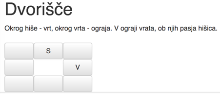
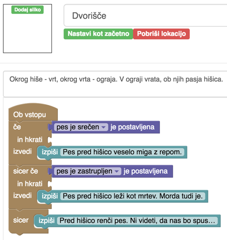
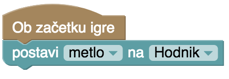
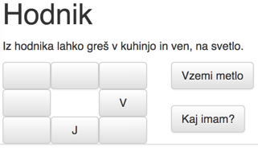
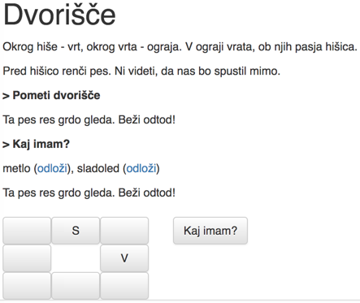
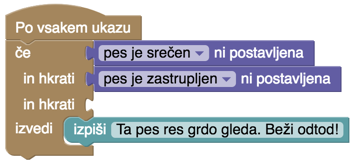

## Ukazi, ki se prožijo kar sami

Vrnimo se k psu, ki je bil včasih tečen, včasih srečen in tečen, včasih zastrupljen. Opis dvorišča bi lahko bil takšen.

Kaj, če bi želeli k opisu dodati še psa? Če ga spremenimo v

> Okrog hiše - vrt, okrog vrta - ograja. V ograji vrata, ob njih pasja hišica, v hišici pes.

bo to pomanjkljivo. Radi bi nekaj od tega:

> Okrog hiše - vrt, okrog vrta - ograja. V ograji vrata, ob njih pasja hišica.
>
> Pred hišico renči pes. Ni videti, da nas bo spustil mimo.

ali

> Okrog hiše - vrt, okrog vrta - ograja. V ograji vrata, ob njih pasja hišica.
>
> Pes pred hišico veselo miga z repom.

ali

> Okrog hiše - vrt, okrog vrta - ograja. V ograji vrata, ob njih pasja hišica.
>
> Pes pred hišico leži kot mrtev. Morda tudi je.

pač odvisno od razpoloženja in stanja, v katerem je pes glede na našo oskrbo s klobasami.

Opis lokacije je le eden. Lahko pa ga dopolnjujemo z dodatnimi izpisi, takole.

V opisu lokacije torej povemo le, kar se izpiše vedno. Ostalo se doda, ko igralec vstopi. Blok *Ob vstopu* že poznamo, uporabili smo ga, da je igralca ob vstopu na škofjeloški grad takoj popadel medved.

Za vajo poskusi narediti tole: v hiši na podstrešju je miš. Če pride igralec na podstrešje s koščkom sira, priteče miš k njemu in igralec jo ujame. Če pride na podstrešje brez sira, pa miš pobegne in igralec je ne vidi nikoli več, tudi če bi prišel kdaj kasneje na podstrešje s sirom.

Blok *Ob izstopu* je podoben bloku *Ob vstopu*. Tudi *Ob izstopu* smo že uporabili: z njim smo pokvarili klobaso, če je igralec pustil odprt hladilnik.

Tretji te blok te vrste je *Na začetku igre*. Ta se sproži, kot lahko uganemo, ob začetku igre. Z njim lahko nastavimo kake začetne zastavice, ali pa razporedimo stvari, da jih lahko igralec vzame, čim pride na kako lokacijo.

Na hodnik sodi metla. Z njo bo lahko igralec pometel dvorišče in dobil za nagrado sladoled.

Na hodnik dodamo

To se bo izvedlo takoj, ko igralec začne igro. Čim pride na hodnik, ga bo tam pričakala metla in sam od sebe se bo pojavil ukaz, s katerim jo lahko vzame.

Kako na dvorišče dodati pometanje in nagrado zanj, pa gotovo že vemo.

Tako dobimo

Samo malo - odkod ti izpisi, da "pes grdo gleda" in "beži odtod"? Tega dobimo z zadnjim od blokov z ukazi, ki se prožijo sami: *Po vsakem ukazu*. Tule smo ga uporabili tako.

Zdaj, ko smo to naredili, pa uredi še, da bo igralec lahko pojedel sladoled. Prej pa dodaj kopalnico in poskrbi, da sladoleda ne bo mogel pojesti, če si prej ne umije rok. Kot vemo, pa si je potrebno po tem, ko jemo sladkarije, umiti zobe. Sladoled naj mu torej umaže zobe, ti pa ga na spusti na cesto, če se prej ne vrne v kopalnico in si jih umije.
