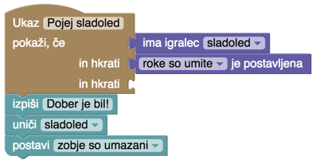
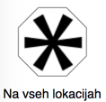
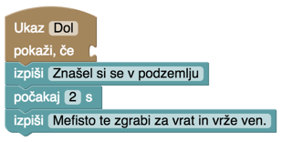
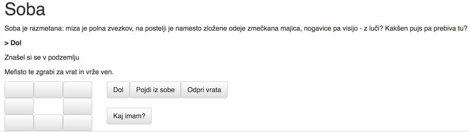
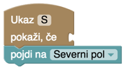
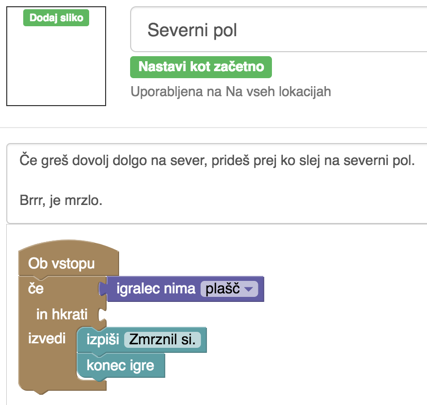

## Ukazi, ki veljajo povsod

Vse ukaze - tiste, ki jih sproži uporabnik in tiste, ki se prožijo sami - smo postavljali na lokacije. Včasih pa moramo sestaviti kak ukaz, ki je na voljo povsod ali pa se sproža povsod. Takšne postavimo na posebno lokacijo z imenom (kdo bi uganil!) *Na vseh lokacijah*.

Se spomniš naloge, ki si jo dobil ob koncu prejšnjega poglavja? Najbrž si uvedel zastavico *ima umite roke*, poleg tega pa imamo stvar *sladoled*. Ukaz *Pojej sladoled* bo potem takšen.

Če igralcu dovolimo, da jé le v kuhinji, bomo ta ukaz postavili v kuhinjo. Če sme sladoled pojesti kjerkoli, pa ga postavimo na *Na vseh lokacijah*.

Na podoben način lahko povsod dodamo smer.

Če takle blok postavimo na vse lokacije, se bo pojavil povsod.

S takšnimi ukazi raje ne pretiravajmo; če bodo na voljo povsod, lahko postanejo navlaka. Če že, jim dodamo pogoje za vidnost, kot pri sladoledu.

Prav tako lahko dodamo ukaz z vdelano smerjo, na primer sever.

Preden lahko sestavimo takšen blok, moramo seveda dodati tudi lokacijo Severni pol. Nanj ne bo dobro hoditi brez potrebne opreme, na kar igralca strogo opozorimo že ob vstopu...

Ukaz, ki velja povsod, lahko povoziš z ukazom, ki velja le na določeni lokaciji. Če bi iz kuhinje potegnili povezavo proti severu na kako drugo lokacijo, tipka S igralca ne bi peljala zmrznit na severni pol, temveč bi ga vodila na to lokacijo. Če bi poleg tega definirali tudi blok S, bi obveljal ta (in ne smer na zemljevidu).

Takšnih stvari sicer raje ne dodajaj v igro, sploh, če je ukaz, ki velja povsod, usoden. Če bo tvoja igra pretežka, boš dosegel le, da je ne bo hotel nihče igrati.
