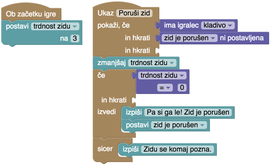
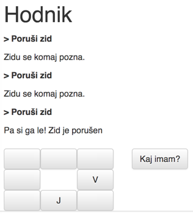
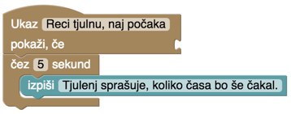
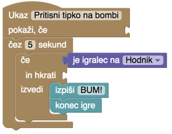

## Še par zanimivih blokov

### Spremenljivke

Tisti, ki poznajo Scratch se nemara sprašujejo, kje so zanke. Ni jih. Za takšne igre jih ne potrebujemo. Tudi besedil ne moremo lepiti skupaj. Kar natipkamo, to imamo.

Imamo le spremenljivke, a še te samo številske in z nič kaj dosti računskimi operacijami. Uporabimo jih lahko, recimo, takole.

Učinek v igri lahko uganeš:

V spremenljivko lahko zabeležimo, koliko denarja ima igralec; ko kaj kupi ali proda, zmanjšamo ali povečamo njeno vrednost. Če bo igralca v igri kdo napadal, si lahko zabeležimo, koliko moči ima še. Morda bo kdaj smiselno omejiti število vstopov na določeno lokacijo...

Ker s spremenljivkami v teh igrah predvsem štejemo, boš zaman iskal bolj zapletene matematične operacije, kot sta množenje ali deljenje. Z njimi nimamo kaj početi.

### Žrebanje

V igri je včasih potrebno kaj prepustiti naključju. Igralca, ki išče poti skozi kleti strašljivega gradu, morda napade vampir. Zid se ne podre po treh udarcih, temveč, če imamo srečo. Prehod na vzhod vodi včasih sem, včasih tja (ta finta je grda, tega ne počni, če ni iz opisa lokacije očitno, da se to dogaja!).

Blok za žreb ima obliko pogoja: izbere si naključno število med 0 in 100 ter preveri, ali je izžrebano število manjše od praga, ki ga podamo.

Takle pogoj bo resničen v polovici primerov. Če 50 spremenimo v 25, bo resničen le še v četrtini primerov, saj je le četrtina števil med 0 in 100 manjše od 25. Če 50 spremenimo v 90, pa bo resničen skoraj vedno (v 90 % primerov), saj so skoraj vsa števila med 0 in 100 (točneje 90 % števil) manša od 90.

### Zakasnjeni ukazi

Zelo zanimiv blok: *čez ... sekund*. Kar stlačimo vanj, se bo izvedlo po predpisanem številu sekund.

To je čudno - kakšen tjulenj že? Tu je druga, nevarnejša uporaba. Recimo, da na hodnik postavimo takšen ukaz:

Kakšna je razlika med *počakaj ... sekund* in *čez ... sekund*? Če uporabimo prvega, se igra ustavi. Če bi pred eksplozijo bombe uporabili *počakaj 5 sekund*, igralec v tem času ne bi mogel zapustiti hodnika, temveč bi moral počakati, da ga raznese. Pri drugem ukazu pa igra teče naprej in igralec lahko zapusti hodnik.

Čeprav se ukaz *čez ... sekund* sproži na določeni lokaciji, se bo izvedel tudi, če gre igralec medtem kam drugam. Zato pri proženju bombe preverjamo, ali je nesrečnik še vedno na hodniku -- ali pa je, še večji nesrečnik ponovno pomolil nos na hodnik ravno, ko je razneslo bombo.

S tem blokom lahko naredimo kar zapletene scenarije: igralec lahko izvede določeno akcijo, na primer pritisne neko tipko v kleti, potem pa ima petnajst sekund časa, da stori nekaj na podstrešju - prej pa mora seveda priti do tja.

### Obiskane lokacije

Kako preveriti, ali je igralec že obiskal določeno lokacijo? To bi lahko storili z zastavico: *ob vstopu* v kuhinjo, postavimo zastavico *je že bil v kuhinji*, pa bo. Ker pa to precejkrat potrebujemo, imamo za to poseben blok.

Najpogosteje nas zanima, ali je igralec prvič na določeni lokaciji. Se spomniš naloge z lovljenjem miši na podstrešju? Dobili naj bi jo le, če imamo takrat, ko pridemo prvič na podstrešje, s seboj sir. Če si tedaj reševal to nalogo, si jo najbrž z zastavico. Zdaj lahko sestaviš krajšo rešitev.
