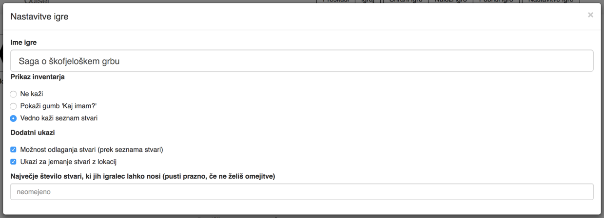

## Nastavitve igre in preskušanje

Vsaka igra ima ime, pa še par lastnosti ji lahko določimo.

Z nastavitvijo **Prikaz inventarja** določimo, ali lahko igralec izve, kaj vse nosi s seboj in kako.

Če izberemo *Ne kaži*, do seznama stvari ne more priti. Zveni čudno, vendar je pogosto smiselno. Nič hudega, če ne izve, da je klobasa, ki jo nosi s seboj, pravzaprav pokvarjena. In če mu je dal Lojze cviček, pač ve, da ima cviček, ne? Ko ga zamenja za puško, pa ima puško.

Če izberemo *Pokaži gumb 'Kaj imam?'* se bo gumb pojavil na vsaki strani, pod običajnimi ukazi. Ko ga igralec pritisne, se izpiše seznam stvari.

*Vedno kaži seznam* pa pod ukazi vedno pokaže seznam stvari.

Če izberemo katero od drugih dveh možnosti in poleg tega obkljukamo *Možnost odlaganja stvari*, se v seznamu stvari za vsako stvarjo pojavi izbira *odloži*, s katero lahko igralec odloži stvar. Stvar ostane na tej lokaciji in jo igralec lahko - ali pa tudi ne - pobere.

Ali jo lahko pobere je namreč odvisno od naslednje izbire, *Ukazi za jemanje stvari z lokacij*. Če jo obkljukamo, se za vsako stvar, ki je na določeni lokaciji, sama od sebe pojavi tipka *Vzemi (in ime stvari)*. Če hočemo igralcu preprečiti jemanje te stvari, določimo - na posamezni lokaciji ali pa na vseh lokacijah - svoj ukaz *Vzemi (in ime stvari)*, ki dela kaj drugega, recimo reče, da te stvari ni mogoče prebrati. Ali pa naredimo ukaz *Vzemi* in poskrbimo, da se ne prikaže. Pa ga ne bo.

Igralcu lahko tudi omejimo število stvari, ki jih lahko hkrati prenaša po svetu.

## Preskušanje igre

Igro lahko igramo ali preskušamo. Temu sta namenjeni tipki *Igraj* in *Preskusi*. *Preskusi* ima dve dodatni možnost, ki ju med igro ni. Lahko se vrnemo v ustvarjanje (s tipko *Ustvari*). V trenutni različici ni ločene strani za igranje igre, tako da bo lahko prijatelj, ki mu daš preskušati igro, preprosto ponovno naložil stran in se znašel v načinu za ustvarjanje. In škilil in goljufal.

Bolj pomembna tipka v načinu preskušanja je *Stanje igre*. Uporabi jo, kadar kaj ne deluje tako, kot si si zamislil. Izvedel boš, katere stvari ima igralec, katere zastavice so nastavljene, kakšne so vrednosti spremenljivk in katere lokacije je že obiskal. Vse te stvari lahko tudi spreminjaš: če bi rad opazoval, kaj se zgodi, ko ima igralec določene stvari, mu jih lahko kar ročno daš, prav tako jih lahko pobrišeš. Spreminjaš lahko seznam obiskanih lokacij, vrednosti spremenljivk ... Igralca lahko celo prestaviš na kako drugo lokacijo. Bolj ko bo tvoja igra zapletena, bolj bo vse tole uporabno.
